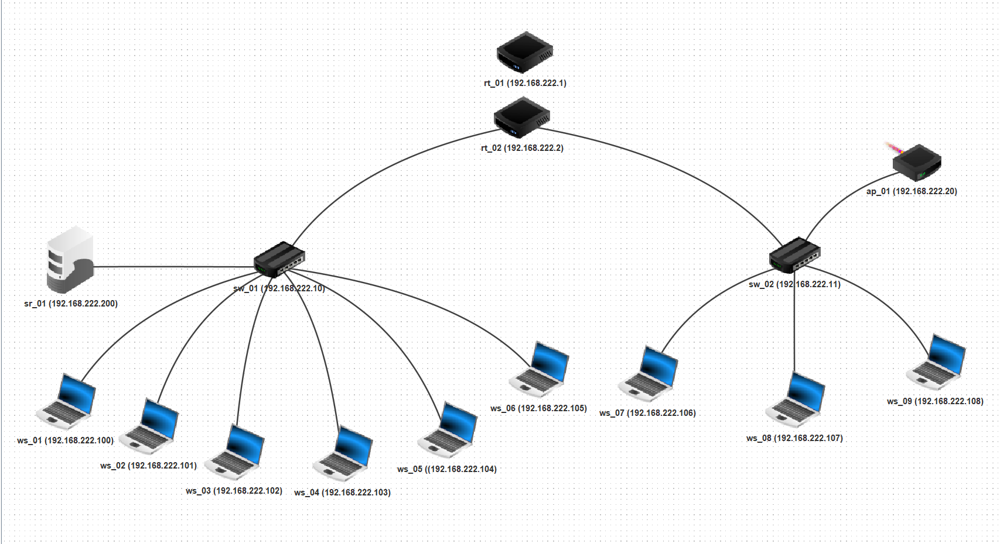

# Network Monitoring Infrastructure Task, 27.02.2023

## Team

### 27.02-28.02 PLA 1

Basil, Luan, Michael, Edlir, Avinash, Ilja, Florin, Enrique, Karma

### 1.03 PLA 1 & PLA 2

Basil, Luan, Michael, Edlir, Avinash, Ilja, Florin, Enrique, Karma, Robin, Mika, Kim, Harun, Arlind, Ryan, Rijha, Nathan

### 02.03-03.03 PLA 2

Robin, Mika, Kim, Harun, Arlind, Ryan, Rijha, Nathan + Karma, Enrique Florin

## Namenskonvention

| Gerät       | Kürzel |
| ----------- | ------ |
| Switch      | sw     |
| Router      | rt     |
| Workstation | ws     |
| Acess Point | ap     |
| Server      | sr     |

### Aufbau

{Namenskürzel}{Nummerierung von 001-999}

## Geräte

### Workstations

| Gerät       | Hostname | IP              |
| ----------- | -------- | --------------- |
| Basils VM   | ws001    | 192.168.222.100 |
| Michis VM   | ws002    | 192.168.222.101 |
| Luans VM    | ws003    | 192.168.222.102 |
| Iljas VM    | ws004    | 192.168.222.103 |
| Avis VM     | ws005    | 192.168.222.104 |
| Eddys VM    | ws006    | 192.168.222.105 |
| Flos VM     | ws007    | 192.168.222.106 |
| Enriques VM | ws008    | 192.168.222.107 |
| Karmas VM   | ws009    | 192.168.222.108 |
| Arlinds VM  | ws010    | 192.168.223.100 |
| Rayans VM   | ws011    | 192.168.223.101 |
| Haruns VM   | ws012    | 192.168.223.102 |
| Kim VM      | ws013    | 192.168.223.103 |
| Robin VM    | ws014    | 192.168.223.104 |
| Mika VM     | ws015    | 192.168.223.105 |
| Nathan VM   | ws016    | 192.168.223.106 |
| Rijha VM    | ws017    | 192.168.223.107 |

### Switches

| IP             | Hostname |
| -------------- | -------- |
| 192.168.222.10 | sw001    |
| 192.168.222.11 | sw002    |
| 192.168.223.10 | sw003    |
| 192.168.223.11 | sw004    |

### Routers

| IP            | Hostname    |
| ------------- | ----------- |
| 192.168.22.1  | core-router |
| 192.168.222.1 | rt001       |
| 192.168.223.1 | rt002       |

### Access Points

| IP             | Hostname |
| -------------- | -------- |
| 192.168.222.20 | ap001    |

### Servers

| IP              | Hostname |
| --------------- | -------- |
| 192.168.222.200 | sr001    |

## DHCP Config

### DHCP Subnet 192.168.222.0/24

### DHCP Subnet 192.168.223.0/24

## Netzwerkplan

